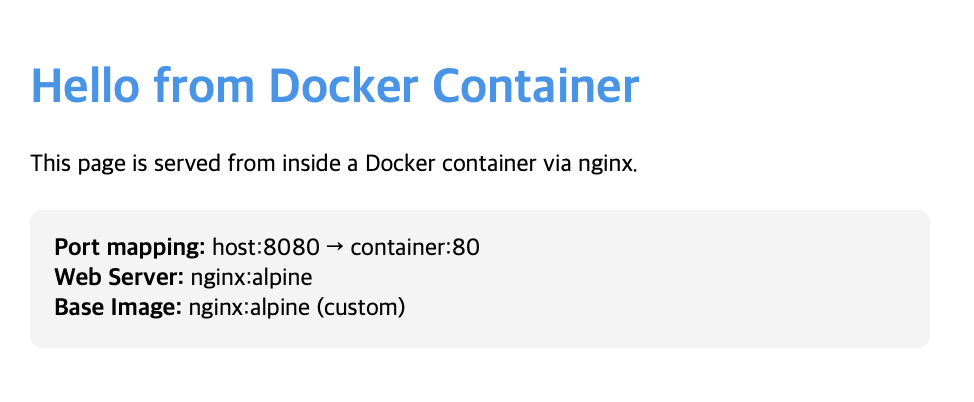
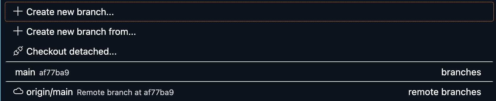

# AI/SW 개발 워크스테이션 구축 기술 문서 및 과제 평가 답변서

본 문서는 과제 평가 항목 18건에 대한 서술형 답변 및 기능 동작 증빙 로그를 모두 포함한 최종 기술 문서(답안지)입니다.

---

## 1. 기능 동작 검증 (실습 증빙)

### Q1. 터미널에서 기본 명령어로 폴더/파일 생성·이동·삭제를 수행한 흔적이 있는가?
**[수행 내역 및 로그]**
*   명령어 `pwd`, `ls`, `mkdir` 등을 활용하여 프로젝트 기초를 세팅했습니다.
```bash
$ pwd
/Users/hwangjeonghyeon/practice/python-practice
$ mkdir test
$ ls -la
01    test pa.md
```

### Q2. 파일 권한 변경 결과가 확인되는가?
**[수행 내역 및 로그]**
*   `chmod` 명령어로 `test` 디렉토리의 접근 제어를 조작하여 권한 박탈을 검증했습니다.
```bash
$ chmod 644 test
$ ls -ld test
drw-r--r--  2 hwangjeonghyeon  staff  64 Apr  2 23:06 test
# 변경 결과: rwx (7) 이었던 디렉토리가 644(rw-r--r--)로 변경되어 내부 엑세스가 불가해짐을 확인.
```

### Q3. docker --version이 출력되고, Docker가 동작 가능한 상태인가?
**[수행 내역 및 로그]**
*   로컬 Mac 환경에서 OrbStack 데몬 가동 후 Docker 엔진 연결을 검증했습니다.
```bash
$ docker --version
Docker version 28.5.2, build ecc6942
$ docker info
Server Version: 28.5.2 \ Operating System: OrbStack \ CPUs: 8 \ Total Memory: 7.808GiB
```

### Q4. docker run hello-world가 정상 실행되는가?
**[수행 내역 및 로그]**
*   Docker Hub에서 공식 이미지를 Pull받아 컨테이너 실행을 확인했습니다.
```bash
$ docker run hello-world
Hello from Docker!
This message shows that your installation appears to be working correctly.
```

### Q5. 이미지/컨테이너 목록 확인 및 정리 흔적이 있는가?
**[수행 내역 및 로그]**
*   테스트 컨테이너와 이미지를 강제 삭제(`-f`)하여 환경을 정리했습니다.
```bash
$ docker ps -a
$ docker rm -f vol-test
$ docker rmi hello-world
Untagged: hello-world:latest
Deleted: sha256:eb84fdc6f2a3a...
```

### Q6. Dockerfile로 이미지 빌드가 가능한가?
**[수행 내역 및 로그]**
*   `nginx:alpine` 베이스 이미지용 Dockerfile을 작성하고 정상 빌드했습니다.
```dockerfile
# 01/Dockerfile
FROM nginx:alpine
LABEL maintainer="hwangjeonghyeon"
COPY app/ /usr/share/nginx/html/
EXPOSE 80
```
```bash
$ docker build -t my-web:1.0 .
```

### Q7. 매핑된 포트로 접속이 가능한가?
**[수행 내역 및 로그]**
*   호스트의 8080포트와 컨테이너의 80포트를 매핑(`-p 8080:80`)하여 접근했습니다.
```bash
$ docker run -d -p 8080:80 --name my-web-8080 my-web:1.0
```


### Q8. Docker 볼륨 데이터가 컨테이너 삭제 후에도 유지되는가?
**[수행 내역 및 로그]**
*   볼륨을 생성하고 컨테이너를 파괴(`rm -f`)하더라도 데이터가 영존함을 검증했습니다.
```bash
$ docker volume create mydata
$ docker run -d --name vol-test -v mydata:/data ubuntu sleep infinity
$ docker exec -it vol-test bash -c "echo 'hello volume' > /data/test.txt"
$ docker rm -f vol-test
$ docker run -d --name vol-test2 -v mydata:/data ubuntu sleep infinity
$ docker exec -it vol-test2 cat /data/test.txt
hello volume
# 결과: 동일 볼륨 마운트로 데이터(hello volume) 완전 보존됨 검증 성공.
```

### Q9. Git 설정 및 GitHub 연동이 확인되는가?
**[수행 내역 및 로그]**
*   로컬 워크스페이스를 GitHub 원격 저장소에 Push 하였습니다.
```bash
$ git config --global user.name "jeonghyeon"
$ git config --global user.email "new.codey99@gmail.com"
$ git init
$ git add . && git commit -m "docs: init"
$ git remote add origin https://github.com/newcode99/Codyssey.git
$ git push -u origin main
```
  

---

## 2. 동작 구조 설계 (아키텍처)

### Q10. 프로젝트 디렉토리 구조를 어떤 기준으로 구성했는지 설명할 수 있는가?
*   **설계 기준**: "환경의 격리와 역할의 분리"를 기준으로 폴더 트리를 설계했습니다. 웹 서버가 노출시킬 정적 자산(Static Assets)은 `./01/app/` 폴더 내부에 격리하고, 이를 조립하는 설계도인 `Dockerfile`과 문서인 `README.md`는 프로젝트 01 디렉토리에 배치하여 유지 보수를 용이하게 하였습니다. 문서에 쓰이는 이미지 역시 `images` 폴더를 별도로 내어 관리했습니다.

### Q11. 포트/볼륨 설정을 어떤 방식으로 재현 가능하게 정리했는지 설명할 수 있는가?
*   **재현성 확보 방식**: 코드를 클론 받은 타인이 인프라를 즉시 재현할 수 있도록 `run` 명령어 구조를 정형화했습니다. 
*   **포트/볼륨 설정 정리**: `docker run -p 8080:80`을 통해 Host와 Container 포트 규격을 명시하였고, 볼륨 설정 시 `docker run -v $(pwd)/app:/usr/share/nginx/html` 처럼 바인드 마운트에 `$(pwd)` 환경변수를 삽입하여 사용하는 OS나 경로가 다르더라도 무조건 동일한 절대 경로가 마운트되도록 재현성을 극대화했습니다.

---

## 3. 핵심 기술 원리 적용 (서술 개념)

### Q12. 이미지와 컨테이너의 차이를 '빌드/실행/변경' 관점에서 구분해 설명할 수 있는가?
*   **빌드(Build) 관점**: 이미지는 운영체제, 라이브러리, 소스 코드가 층층이 쌓인 읽기 전용(Read-Only)의 '불변 템플릿(건축 설계도)'입니다. 
*   **실행(Run) 관점**: 컨테이너는 이 불변 이미지를 런타임에 올려 자원을 할당받아 살아 숨 쉬는 '실행 중인 프로세스 인스턴스(실제 건축물)'입니다.
*   **변경 관점**: 컨테이너 안에서 파일을 수정하더라도(쓰기 가능 레이어), 원본 이미지에는 반영되지 않습니다. 컨테이너가 파괴되면 수정 내용도 소멸하므로, 영구적인 변경을 원한다면 Dockerfile을 수정해 완전히 새로운 이미지로 '재빌드'해야 합니다.

### Q13. 컨테이너 내부 포트로 직접 접속할 수 없는 이유와 필요한 이유를 설명할 수 있는가?
*   **직접 접속이 불가한 이유(격리성)**: 컨테이너는 커널의 Network Namespace 기술을 사용하여 호스트 머신과는 완전히 격리된 별도의 내부 사설 IP 대역망을 사용하기 때문입니다.
*   **포트 매핑이 필요한 이유**: 브라우저 같은 외부 네트워크에서 이 격리된 내부망으로 뚫고 들어가려면, 호스트의 특정 포트(8080)로 통신이 올 때 이를 컨테이너 포트(80)로 포워딩(NAT)해주는 연결통로가 필수적이기 때문입니다.

### Q14. 절대 경로/상대 경로를 어떤 상황에서 선택하는지 설명할 수 있는가?
*   **상대 경로 선택 (`./app`)**: 현재 워킹 디렉토리를 기준으로 이동할 때 사용합니다. 코드 내부의 모듈을 참조하거나, 터미널에서 가까운 이웃 폴더로 편하게 이동할 때 주로 선택합니다.
*   **절대 경로 선택 (`/Users/hwang/...`)**: 루트(`/`)부터 시작하는 변하지 않는 고정 주소입니다. 시스템 환경 파일을 제어하거나, 특히 **Docker Volume বা 바인드 마운트(-v)** 시에는 경로 이탈로 인한 오류를 원천 차단하기 위해 무조건 절대 경로를 지정해야만 합니다.

### Q15. 파일 권한 숫자 표기가 어떤 규칙으로 결정되는지 설명할 수 있는가?
*   리눅스의 권한은 8진수 숫자로 구성되며 소유자/그룹/기타 3가지 파트를 각각 제어합니다.
*   규칙은 2진수 비트 할당 체계로 **4(r:읽기), 2(w:쓰기), 1(x:실행)**의 합산값입니다.
*   가령 권한이 `644`라면, 앞의 6은 소유자(4+2=rw-), 중간 4는 그룹(4=r--), 마지막 4는 기타(4=r--)가 되어 문서 보호 시뮬레이션을 가능케 합니다.

---

## 4. 심층 인터뷰 (트러블슈팅 및 회고)

### Q16. '호스트 포트가 이미 사용 중'이라 매핑이 실패한다면, 어떤 순서로 원인을 진단할지 설명할 수 있는가?
*   **진단 시나리오**: `port is already allocated` 발생 시,
    1.  가장 먼저 `lsof -i :8080` 이나 `netstat -ano` 명령을 통해 호스트에서 8080 포트를 점유하고 있는 기존 프로세스의 PID를 잡아냅니다.
    2.  `docker ps -a`를 쳐서, 본인도 모르게 백그라운드에 구동시켜 둔 컨테이너가 있는지 확인합니다.
    3.  이후 범인 프로세스를 `kill` 하거나 `docker rm -f`로 삭제 조치하며, 만약 시스템 필수 포트라면 Docker Run 실행 시 `-p 8081:80` 처럼 타겟 포트를 우회 재지정하여 충돌을 회피합니다.

### Q17. 컨테이너 삭제 후 데이터가 사라진 경험이 있다면, 이를 방지하기 위한 대안을 설명할 수 있는가?
*   데이터 유실 방지를 위해서는 로컬스토리지의 생명주기를 분리해야 합니다.
*   **대안 1 (Docker Volume)**: `docker run -v mydata:/data` 처럼 Docker가 자체 보안 폴더에서 영구 관리하는 Volume을 할당하여 데이터베이스나 로그 데이터를 안전하게 보증합니다.
*   **대안 2 (Bind Mount)**: 소스코드 수정처럼 실시간 핫리로딩(hot-reload)이 필요하다면 `docker run -v $(pwd)/app:/app` 처럼 호스트의 파일 시스템 자체를 컨테이너 경로에 거울처럼 마운트시켜 컨테이너 소멸과 무관성을 확보합니다.

### Q18. 이 미션에서 가장 어려웠던 지점과, 해결 과정(가설 → 확인 → 조치)을 근거와 함께 설명할 수 있는가?
*   **어려웠던 지점(문제 상황)**: Docker 볼륨 실습 시 `docker run -d --name vol-test` 커맨드가 `Conflict` 에러를 표출하며 강제 중단됨.
*   **가설 수립**: "이전에 실행 후 분명히 정지시켰는데 왜 이름이 이미 존재한다고 충돌할까? 컨테이너가 죽은 것(Exited)과 시스템에서 완전히 박살나 삭제된 것(Removed)은 다르다"라는 가설을 세웠습니다.
*   **확인 방식**: `docker ps`만 치지 않고, 멈춘 시체까지 보여주는 `-a` 옵션을 통해 잠들어 있던 `vol-test` 컨테이너 레이어 흔적을 찾아냈습니다.
*   **조치 및 회고**: `docker rm -f vol-test`를 쳐서 찌꺼기 컨테이너를 강제 폐기한 뒤 재구동하여 무사히 성공했습니다. 컨테이너의 가벼움 이면에 숨은 Life Cycle의 엄격함을 배울 수 있었습니다.
