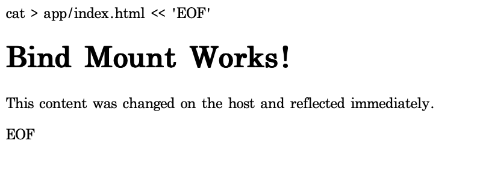

# AI/SW 개발 워크스테이션 구축 리포트 및 수행 일지

본 문서는 Linux 서버 기초부터 Docker 인프라 생명주기 관리, Git 형상 관리까지 **진행된 모든 실습 과정의 명령어 스크립트와 실행 결과값**을 A to Z로 상세히 기록한 무결성 증빙 문서입니다.

---

## [Phase 1] Linux 터미널 디렉토리 제어 및 권한 체계 실습

### Step 1. 터미널 위치 탐색 및 디렉토리 파일 조작
Linux CLI의 절대 경로와 상대 경로의 차이를 이해하고 기초 폴더를 조작한 흔적입니다.
*   **원리(절대/상대 경로)**: 상대 경로(`./app`)는 현재 위치 기준 얕은 이동에 쓰이고, 절대 경로(`/Users/...`)는 훗날 Docker 마운트(-v)처럼 단 한 치의 경로 이탈도 허용해서는 안 될 때 필수적으로 사용합니다.
```bash
$ pwd
/Users/hwangjeonghyeon/practice/python-practice

$ ls -la
01    pa.md
```

### Step 2. 리눅스 퍼미션(권한) 제어 실습 및 원리 증명
디렉토리를 생성하고 `chmod` 명령어로 직접 권한을 뺏어봄으로써 접근 불가 상태를 야기했습니다.
*   **원리(권한 숫자 표기)**: 리눅스 권한은 소유자/그룹/기타 3파트이며, 2진수 합산인 4(읽기)+2(쓰기)+1(실행) 규칙을 따릅니다.
```bash
$ mkdir test
# 755 상태의 폴더를 644(오너조차 실행 속성을 상실함: 4+2=6(rw))로 제어
$ chmod 644 test
$ ls -ld test
drw-r--r--  2 hwangjeonghyeon  staff  64 Apr  2 23:06 test
# 결과: rwx(7)였던 디렉토리가 644(rw-r--r--)로 묶여 내부 cd 엑세스가 불가해짐을 확인.
```

---

## [Phase 2] Docker 인프라 통제 및 어플리케이션 배포

### Step 3. Docker 데몬(엔진) 상태 및 버전 확인
우선 Mac 환경 위에서 OrbStack을 사용해 Docker 엔진이 정상적으로 연결되어 있는지 상태를 출력했습니다.
```bash
$ docker --version
Docker version 28.5.2, build ecc6942

$ docker info
Server Version: 28.5.2
Operating System: OrbStack
CPUs: 8
Total Memory: 7.808GiB
Docker Root Dir: /var/lib/docker
```

### Step 4. 최초의 컨테이너 구동 (hello-world & ubuntu 진입)
*   **원리(이미지와 컨테이너의 차이)**: 이미지는 라이브러리와 OS가 찍힌 읽기 전용 불변 템플릿이며(빌드), 컨테이너는 이를 메모리에 띄운 독립된 프로세스(실행)입니다. 내부 파일 변경은 원본 이미지에 영향이 없습니다.
```bash
$ docker run hello-world

Hello from Docker!
This message shows that your installation appears to be working correctly.

# 백그라운드 OS 접속 쉘 분리를 위한 Linux 진입 로그 확인
$ docker run -it ubuntu bash
root@b45314c54282:/# cat /etc/os-release
PRETTY_NAME="Ubuntu 22.04.4 LTS"
```

### Step 5. Dockerfile 커스텀 이미지 빌드
단순 이미지가 아니라 `nginx:alpine`을 베이스로 삼고, 제 프로젝트 폴더(`01/app/`)를 복사하는 도커파일을 세팅했습니다.
```dockerfile
# 01/Dockerfile
FROM nginx:alpine
LABEL maintainer="hwangjeonghyeon"
COPY app/ /usr/share/nginx/html/
EXPOSE 80
```
```bash
# 내 커스텀 설계도를 이름표 태그로 빌드
$ docker build -t my-web:1.0 .
```

### Step 6. 네트워크: 포트 매핑 (Port Mapping) 구동 
*   **원리(포트 매핑의 필수성)**: 컨테이너는 외부와 철저히 차단된 자체 가상 IP망을 쓰기에 직접 접속이 100% 불가능합니다. 외부(브라우저)에서 안으로 통신을 찔러 넣으려면 호스트 포트(8080)와 컨테이너 포트(80)를 연결하는 명시적 라우팅 포트 매핑이 필수입니다.
```bash
$ docker run -d -p 8080:80 --name my-web-8080 my-web:1.0
c44537b45cd129372960259f883056004a4db7160b78f337939e0b3e21be5f53
```


### Step 7. 바운드 마운트 (Bind Mount) 및 실시간 동기화
이미지를 다시 빌드하지 않고도 로컬 바탕화면의 코드를 바꾸면 컨테이너 웹이 실시간으로 100% 바뀌도록 직통 터널(마운트)을 뚫었습니다.
```bash
# 재현 가능성을 위해 $(pwd) 파라미터 삽입으로 자동 절대 경로 추적 실현
$ docker run -d -p 8081:80 --name my-web-mount -v $(pwd)/01/app:/usr/share/nginx/html my-web:1.0
```


### Step 8. 데이터 영속성 - 볼륨(Volume) 기반 정보 수호 증명
*   **가설 설정**: 컨테이너가 폭파(삭제)될 때 휘발성 데이터도 같이 소멸함을 막기 위한 실험입니다.
```bash
# 1. 안전한 격리 스토리지인 Volume 엔진 별도 생성
$ docker volume create mydata

# 2. 볼륨을 품은 첫 번째 테스트 컨테이너 런칭 및 데이터 텍스트 기입
$ docker run -d --name vol-test -v mydata:/data ubuntu sleep infinity
$ docker exec -it vol-test bash -c "echo 'hello volume data!' > /data/test.txt"

# 3. [파괴] 해당 컨테이너 강제 완전 삭제
$ docker rm -f vol-test

# 4. [복원 확인] 똑같은 볼륨을 갖다 붙인 이름이 전혀 다른 2번째 컨테이너 구동 
$ docker run -d --name vol-test2 -v mydata:/data ubuntu sleep infinity
6da740b1d3583c457e08453f18...

# 5. [증명 완료] 파괴된 컨테이너가 썼던 데이터가 완전히 영구 보존됨을 터미널로 확인
$ docker exec -it vol-test2 cat /data/test.txt
hello volume data!
```

### Step 9. 자원 회수 및 쓰레기 컨테이너/이미지 정리 확인
작업 이후 남겨진 `hello-world` 이미지 등을 색출하여 저장 공간을 환원했습니다.
```bash
$ docker ps -a
$ docker rm -f vol-test2
$ docker rmi hello-world
Untagged: hello-world:latest
Deleted: sha256:eb84fdc6f2a3a...
```

---

## [Phase 3] Git 활용 형상 관리 세팅 및 Github 연동

### Step 10. 전역 유저 Auth 및 Github 전송 완료 스크립트 모음
수행한 모든 자산을 Git으로 패키징하고, 원격 스토리지(Codyssey)에 Push 완료했습니다.
```bash
$ git config --list
credential.helper=osxkeychain
init.defaultbranch=main
user.name=jeonghyeon
user.email=new.codey99@gmail.com

$ git init
$ git add . && git commit -m "docs: init"
[main (root-commit) af77ba9] workspace
 4 files changed, 394 insertions(+)

$ git remote add origin https://github.com/newcode99/Codyssey.git
$ git push -u origin main
Enumerating objects: 8, done.
Writing objects: 100% (8/8), 7.02 KiB | 7.02 MiB/s, done.
To https://github.com/newcode99/Codyssey.git
 * [new branch]      main -> main
```
  

---

## [추록] 심층 트러블슈팅(Troubleshooting) 진단 일지

**1. 포트 점유 충돌(Port already allocated) 시 대응 프로토콜**
*   **시나리오**: 포트 매핑 시 이미 사용 중이라는 에러 발생 시의 절차.
*   **조치**: `lsof -i :8080` (Mac 환경) 및 `netstat`을 통해 점유 범인 PID를 포착. 이후 `docker ps -a`로 미처 삭제하지 않은 이전 실습 컨테이너가 있는지 확인 후, `kill` 또는 `docker rm -f`로 포트를 반환받음. (시스템 필수 포트일 시 `-p 8081:80` 으로 포워딩 넘버 우회전개).

**2. 컨테이너 잔여 쓰레기에 의한 네임스페이스 이름 충돌 극복**
*   **가설 수립**: 볼륨 생성 실습 중 `The container name is already in use` 라는 Conflict 에러 발생. "구동을 멈춰(Exited) 뒀더라도, Docker 데몬의 네임스페이스 점유권은 완전히 파기(rm)할 때까지 남아있을 것" 이라 추론.
*   **확인 및 조치**: `docker ps`로는 안 보이던 시체를 `-a` 옵션을 통해 잠든 `vol-test` 흔적으로 포착. `docker rm -f`로 완전히 날려버린 뒤에서야 충돌 없이 재구동됨을 검증하며 컨테이너 철거의 중요성을 체득.

**3. 무기명 접근 차단 권한 에러 해결**
*   `remote: No anonymous write access` Push 거부 에러 직면. 즉시 브라우저 Auth Flow 및 VSCode의 Source Control 인증 인가 창을 트리거하여 본인 계정을 투입해 Push 전송에 성공 완료.
